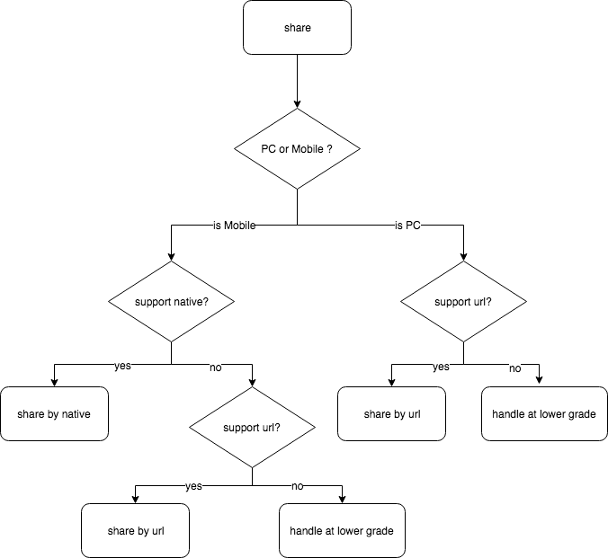

# ohu-share

跨浏览器的分享插件，可优雅降级

## Todo

1. 浏览器不支持scheme的情况
2. QQ和微信内置浏览器还未支持
3. 原生分享不支持的情况能够继续执行下个策略

## 分享策略

该分享插件秉持稳定，可靠的特点，可在PC端和移动端分别进行分享，移动端如果目标分享对象支持原生调用分享，那就进行原生分享，如果不支持，使用URL分享；PC端则一贯使用URL分享。

**分享目标**

✅ 微信好友

✅ 微信朋友圈

✅ QQ好友

✅ QQ空间

✅ 微博

**移动端浏览器支持列表**

✅ QQ浏览器 

✅ UC浏览器 

✅ QQ内置浏览器 

✅ 微信内置浏览器 

✅ 百度浏览器

